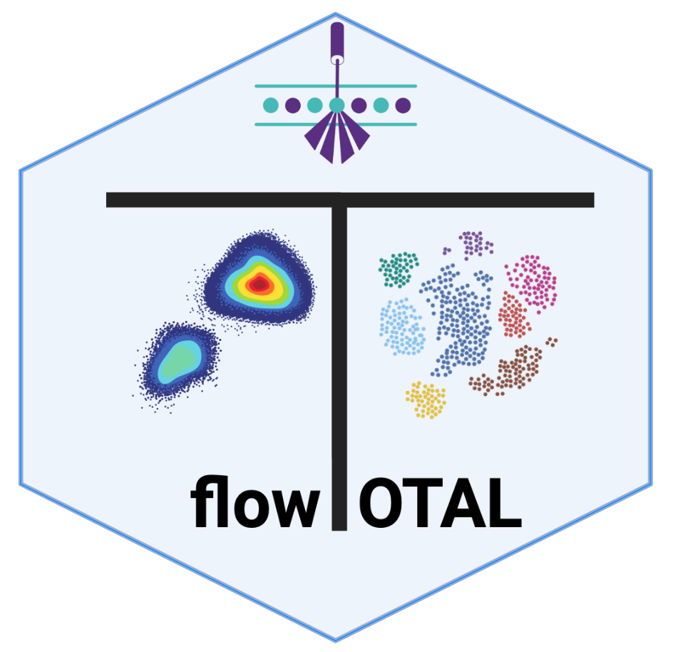
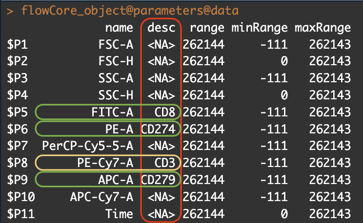

[]()


# flowTOTAL: flow cyTometry auTOmaTic AnaLysis <a href='https://github.com/ImmunoOncology/flowTOTAL'></a>

## Overview

flowTOTAL is a user-friendly command line workflow to analyze flow cytometry data. Preprocessing, conventional analysis, and unsupervised analysis are the three primary portions of the pipeline. The user must specify the folder containing the FCS files, the metadata associated with each file, and the back-gating marker as input. During preprocessing, each.FCS will be corrected for fluorescence spillover (compensation), abnormalities will be detected by evaluating flow rate and signal acquisition, and doublets will be removed using forward scatter (QC). A population of interest will be specified for the traditional analysis, and the pipeline will proceed with normalization, dimensionality reduction, and clustering.

## Installation


```{R}

if (!require("BiocManager", quietly = TRUE))
    install.packages("BiocManager")

devtools::install_github("RGLab/RProtoBufLib")
devtools::install_github("RGLab/cytolib")
devtools::install_github("RGLab/flowCore")
devtools::install_github("RGLab/flowWorkspace")
devtools::install_github("RGLab/ggcyto")
devtools::install_github("RGLab/openCyto")
devtools::install_github("RGLab/flowStats")
devtools::install_github("giannimonaco/flowAI")
devtools::install_github("saeyslab/PeacoQC")

remotes::install_github(repo = "ImmunoOncology/flowTOTAL", ref = "dev-1.0.0")

```


## Creating the `panel_estimate.txt` File for Panel Estimation

To create the tabular file required for Panel Estimation, follow these steps:

1. **Objective Channels Check**: Begin by inspecting the flowCore object to identify the relevant objective channels contained within the FCS file. These channels are essential for performing flowTOTAL analysis.

    

  In the above image, the red rectangle highlights where to locate the channels relevant for flowTOTAL analysis. Focus only on channels without NA values (indicated by the green rectangle). In this specific example, we intend to use the positive CD3 (CD3+) channel for backgating.

2. **Creating `panel_estimate.txt`**: The `panel_estimate.txt` file requires two columns: **Pattern** and **Label**.

   - **Pattern**: This column defines the gating instructions for each population. Each row corresponds to a specific population. The following schema outlines how to define populations:
   
     - Population based on one channel:
       - `chnlA+`: Positive density gate of channel A.
       - `chnlA-`: Negative density gate of channel A.
       - `chnlA$+`: Positive density gate of channel A, positioned to the left of the positive density gate.
       - `chnlA^+`: Positive density gate of channel A, positioned to the right of the positive density gate.
       - `chnlA$-`: Negative density gate of channel A, positioned to the left of the negative density gate.
       - `chnlA^-`: Negative density gate of channel A, positioned to the right of the negative density gate.

     - Population based on two consecutive channels:
       - `chnlA+.chnlB-`: Positive density gate of channel B, based on the population selected in the positive density gate of channel A.

     - Population based on two channels:
       - `chnlA+:chnlB-`: Simultaneously gate on both channel A and channel B.

   - **Label**: This column contains labels to identify the gated populations.

Example: 

| **Pattern**               | **Label**  |
|---------------------------|------------|
| CD3+                      | CD3 Tcell  |
| CD3+.CD8+                 | CD8 Tcell  |
| CD3+.CD8+.CD279$+;CD274^- | PD1 Tcell  |
| CD3+.CD8+.CD279$-;CD274^+ | PDL1 Tcell |


By following this format, the `panel_estimate.txt` file will contain the necessary instructions for gating populations in the flowTOTAL analysis.

## Quick start

```{R}

library(flowCore)
library(flowTOTAL)

fcs_path <- file.path(system.file("extdata", package="flowTOTAL"), "example.fcs")
panel_estimate <- file.path(system.file("extdata", package="flowTOTAL"), "panel_estimate.txt")

runFlowTOTAL(
 fcs_path = fcs_path,
 output = "output_directory",
 panel_backgating = "CD3+",
 panel_estimate = panel_estimate,
 cluster = NULL,
 steps = c("runPreprocessing", "runDensityBackgating", "runEstimateProportion")
)

```


## Version 

1.0.2
